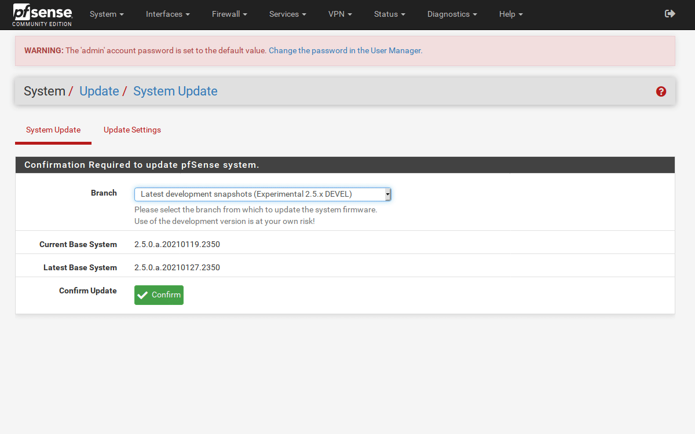

# pfSense-pkg-openvpn-multihop
Provides an easy way to setup multihop OpenVPN Connections. 



### Work in Progress.

This utility will allow you to create a list of OpenVPN Tunnels and start them cascaded.   
e.g The the second tunnel will be established trough the first tunnel and so on.   

Please see this Repo for more [details](https://github.com/ddowse/pf-tunnelactive) in Setup and   
preperations.   

## Installation 

```bash: 
fetch https://github.com/ddowse/pfSense-pkg-openvpn-multihop/releases/download/alpha-v0.1_9/pfSense-pkg-openvpn-multihop-0.1_9.txz   
pkg add pfSense-pkg-openvpn-multihop-0.1_9.txz
```

# TODO: 
- ~If OpenVPN Client is in list - remove from Select Menu to avoid double selection~
- ~Add route-up command to custom-options of tunnel. [details](https://github.com/ddowse/pf-tunnelactive#cascading-vpn)~
- ~Add code to delete route-up~ 
- ~Add autorestart option~
- Add User Guide

# Nice to have
- Profiles
- Not going to happen ~Auto add NAT Rules~ 

#### Note: This Package is/was made for a client of mine and the client wanted it to be also available for the pfsense and open-source community.  

So... 

Thanks John! :thumbsup:
