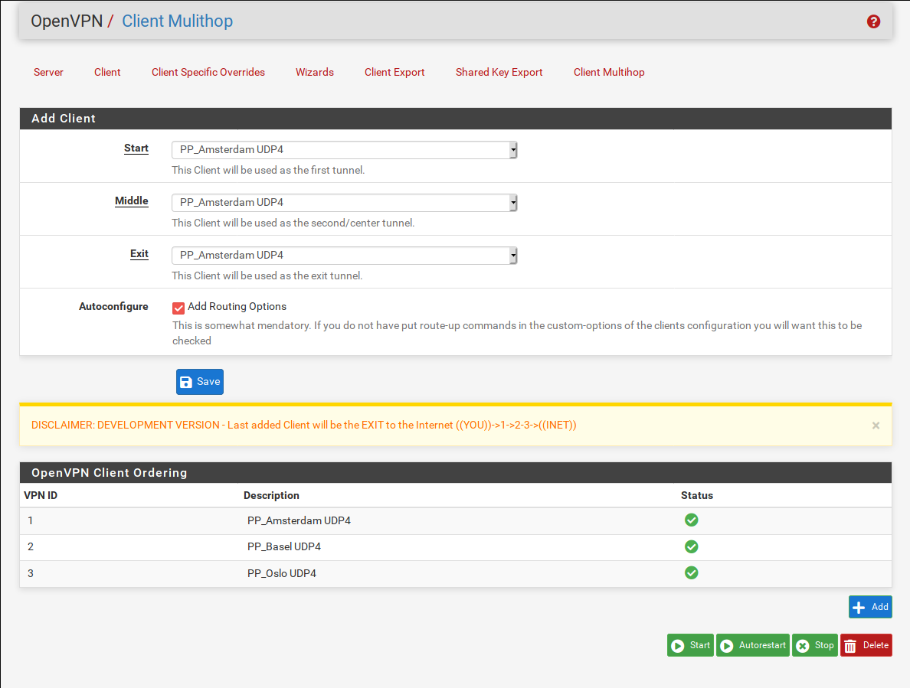

# pfSense-pkg-openvpn-multihop
Provides an easy way to setup multihop OpenVPN Connections. 



### Work in Progress.

This utility will allow you to create a list of OpenVPN Tunnels and start them cascaded.                                                                                                                                                                                                                                                                                    
e.g The the second tunnel will be established trough the first tunnel and so on. 

Please see this Repo for more [details](https://github.com/ddowse/pf-tunnelactive)
                                                                                                                                                                                                                                                                                                                                                                            
## Installation 

```bash: 
fetch https://github.com/ddowse/pfSense-pkg-openvpn-multihop/releases/download/v0.1_1/pfSense-pkg-openvpn-multihop-0.1_1.txz
pkg add pfSense-pkg-openvpn-multihop-0.1_1.txz
#delete
pkg delete pfSense-pkg-openvpn-multihop-0.1_1.txz
```

# TODO: 
- If OpenVPN Client is in list - remove from Select Menu to avoid double selection
- Add route-up command to custom-options of tunnel. [details](https://github.com/ddowse/pf-tunnelactive#cascading-vpn)
- Add autorestart option

# Nice to have
- Profiles
- Auto add NAT Rules

Note: This Package was made as a project for a client who wanted it to be available for the pfsense and open-source community, too. Thanks John!
