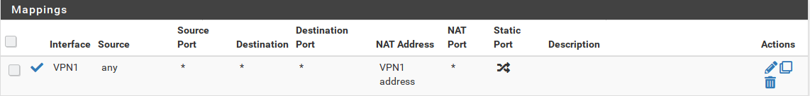

# pfSense-pkg-openvpn-multihop
Provides an easy way to setup multihop OpenVPN Connections. 

This utility will allow you to create a list of OpenVPN Tunnels and start them cascaded.

e.g The the second tunnel will be established trough the first tunnel and so on.   

Please see this Repo for more [details](https://github.com/ddowse/pf-tunnelactive) in Setup and preperations.


## Build

You will need a FreeBSD build environment. 

```bash:
git clone git@github.com:pfsense/FreeBSD-ports.git pfSense-ports
cd pfSense-ports/security
git clone https://github.com/ddowse/pfSense-pkg-openvpn-multihop
cd pfSense-pkg-openvpn-multihop
make package
```

Please check the [pfSense package development documentation](https://docs.netgate.com/pfsense/en/latest/development/developing-packages.html#testing-building-individual-packages) for more information.


## Installation 

```bash:
pkg add https://github.com/ddowse/pfSense-pkg-openvpn-multihop/releases/download/v1.0/pfSense-pkg-openvpn-multihop-1.0.txz
```

## Preperations (in General)

- **Create Backup of your configuration!**

- Make sure that your OpenVPN Clients connected succesfully to your provider
- Make sure that NAT is set properly to **Manual Outbound NAT** 
- Make sure that NAT on each VPN Interface is set 

e.g:

```bash:
  nat on ovpnc1 inet all -> (ovpnc1) port 1024:65535 round-robin
```



## Usage

- If 'keepalive' is checked a background process is started once all tunnels are up. It will check the status of all tunnels one by one every 3 seconds. If any tunnel of the configured tunnels is down, all tunnels brought down and the cascade will be restarted. 

## Create 

- Navigate to VPN -> OpenVPN -> Client Multihop
- Click the add button 
- Choose 2 OpenVPN Clients from the dropdown menue
- Click save
- Click apply to save and start
- Wait aprox. 30 seconds for page to refresh and checkmarks turned green

## Extend 

- Click the add Button
- Choose OpenVPN Client
- Save and click apply
- Wait aprox. 30 seconds for page to refresh and checkmarks turned green

## Start

- Will start the tunnels one by one. 
- Will start background process if keepalive was checked on creation.

## Stop

- Click stop this will also kill the keepalive process

## Delete

- Will remove all configuration, can't be undone. 


## Trouble shooting

- Click Stop
- Click Start
 

Check routing like this

```bash:
netstat -4nr
```

Check tunnel(s) for passing openvpn traffic
Interface and Port may vary

```bash:
tcpdump -nv -i ovpnc1 port 1149
```

```bash:
curl ifconfig.co
```

Don't forget to check your logs(!)

## Issues

- Please report any issues via github
- Thorough testing was done with Perfect Privacy VPN *only*


## Acknowledgment

**"John"** had the idea for this package and provided the initial financial support to make it possible. Thanks. 

## Donations 

If you like this package and show your support you can do this via [PayPal](https://www.paypal.com/paypalme/DanielDowse) at the moment.
If you want to get in touch with check my [homepage](https://daemonbytes.net)
